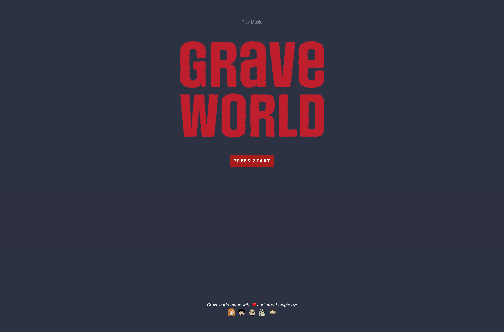
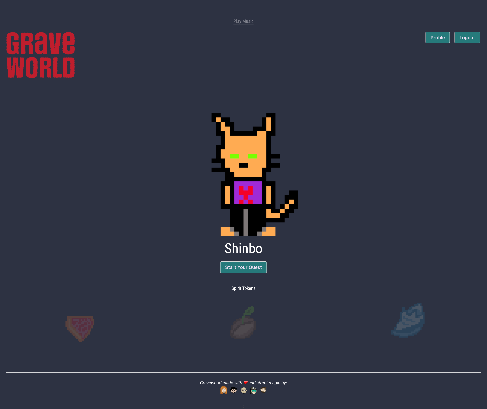
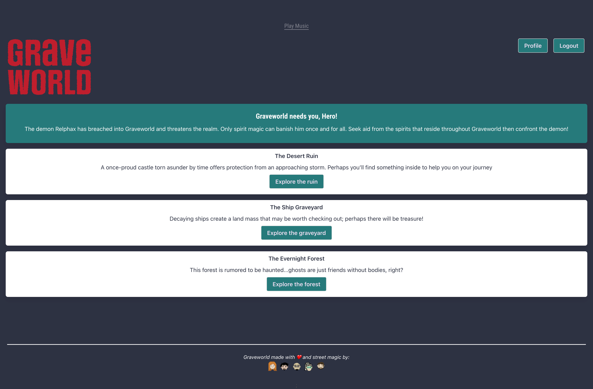

# graveworld 

## Table of Contents:

- [Description](./README.md#description)
- [License](./README.md#license)
- [Contributing](./README.md#contributing)
- [Screenshot](./README.md#screenshot)
- [Links to Application](./README.md#links-to-application)

## Description

This is what I have in the presentation: Graveworld is a fantasy game where authenticated users can set up a profile, play 3 riddle games, earn correlating “Spirit Tokens” for successfully completing those challenges and go on to defeat the demon of Graveworld.

## License

This software is licensed to MIT, for more information you may visit this link:
[MIT License Wikipedia](https://en.wikipedia.org/wiki/MIT_License)

## Contributing

If you wish to contribute to our content, please contact one of us at:

- Jon Chirinos [Github](https://github.com/Jonchirinos)

- Gwen Ewasko [Github](https://github.com/gwenewasko)

- Sarah Ann Williams [Github](https://github.com/Sarahlophus)

- Mousa Haddadin [Github](https://github.com/mhaddadin1)

- Stephen Marr [Github](https://github.com/smarr2198)

## Screenshot

## Links to Application

- Here is the link to the repo: [graveworld/repo](https://github.com/Street-Magicians/graveworld)
- Here is the link to the heroku: [graveworld/heroku](https://grave-world.herokuapp.com/)
